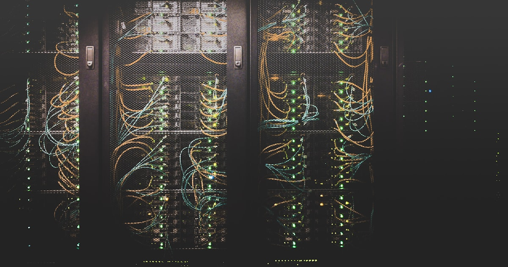
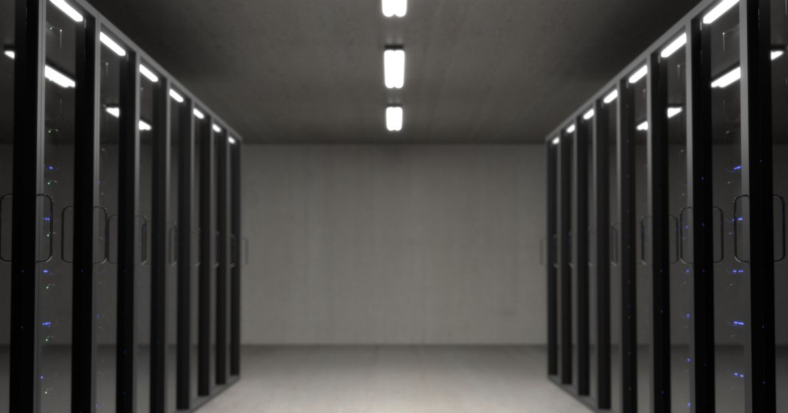
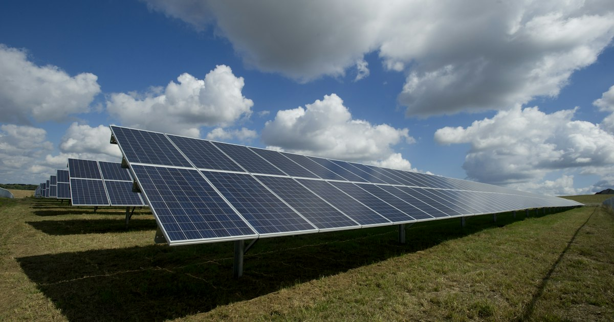
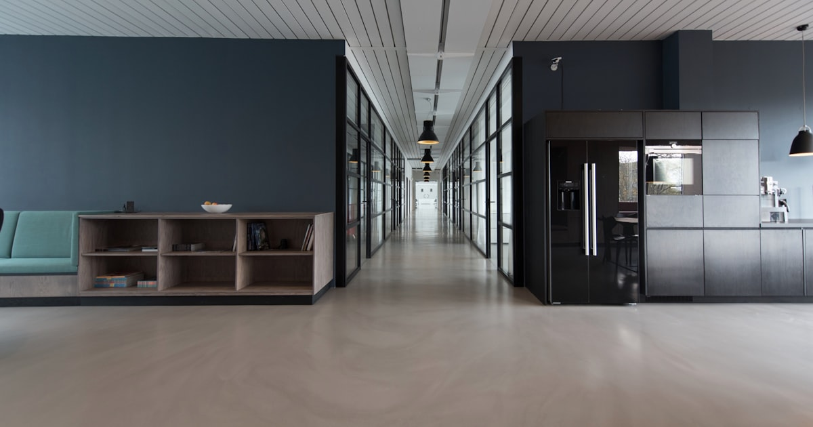
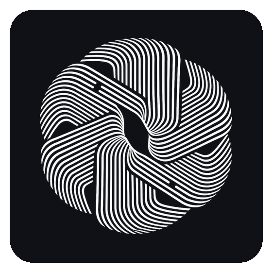

<div align="center">
  <a href="https://www.ramioo.com">
    
    
  </a>
  <br/>
  <a href="https://www.ramioo.com">
    
  </a>
  <h1>
    <a href="https://www.ramioo.com">www.ramioo.com</a>
  </h1>
  <p>
    <b>Network infrastructure · Datacenter · Software systems</b><br/>
    Design and delivery from Tabriz — racks, switching, servers, and production apps under the <b>ramioo</b> brand.
  </p>
  <p>
    <a href="https://www.ramioo.com"></a>
    <a href="https://www.ramioo.com/projects"></a>
    <a href="https://www.ramioo.com/contact"></a>
  </p>
</div>

<p align="center">
 <a href="https://www.star-history.com/ramincsy">
  <picture>
   <source media="(prefers-color-scheme: dark)" srcset="https://api.star-history.com/badge?user=ramincsy&year=2026&theme=dark" />
   <source media="(prefers-color-scheme: light)" srcset="https://api.star-history.com/badge?user=ramincsy&year=2026" />
   
  </picture>
 </a>
</p>

<p align="center">
  
  
  
</p>

<div align="center">
  <a href="https://twitter.com/ramin_csy"></a>
  <a href="https://www.linkedin.com/in/raminzalizadeh"></a>
  <a href="https://medium.com/@ramincsy"></a>
  <a href="https://instagram.com/ramin_csy"></a>
  <a href="mailto:ramincsywork@gmail.com"></a>
</div>

<p align="center">
 <a href="https://www.star-history.com/ramincsy">
  <picture>
   <source media="(prefers-color-scheme: dark)" srcset="https://api.star-history.com/badge?user=ramincsy&year=2026&theme=dark" />
   <source media="(prefers-color-scheme: light)" srcset="https://api.star-history.com/badge?user=ramincsy&year=2026" />
   
  </picture>
 </a>
</p>

---

### 👋 About

I'm **Ramin** (`ramincsy`). Through **[ramioo](https://www.ramioo.com)** I design and operate **network & datacenter infrastructure** (racks, servers, switching, firewall, cabling) and build **production software** for fintech, energy, security, and enterprise operations.

```typescript
const ramin = {
  github: "ramincsy",
  brand: "ramioo",
  site: "https://www.ramioo.com",
  location: "Tabriz, Iran",
  focus: ["Network & Datacenter", "Full-stack systems"],
  infra: ["racks", "servers", "switching", "firewall", "cabling"],
};
```

- **Network & datacenter** — server rooms, racks, switching, firewalls, LAN/WAN
- **Sarafchi** — currency-exchange accounting, balances, TRON / USDT deposits
- **Public tools** — coin address format checks and multi-network balance polling
- **Contact** — [ramincsywork@gmail.com](mailto:ramincsywork@gmail.com)

---

<div align="center">
  
</div>

<h2 align="center">Network infrastructure · Equipment · Servers & racks</h2>

<p align="center">
  <b>Design, install, and maintain server rooms, racks, switches, firewalls, and structured cabling</b><br/>
  <a href="https://www.ramioo.com/services">Infrastructure services on ramioo.com</a>
</p>

<table>
  <tr>
    <td align="center" valign="top" width="50%">
      <a href="https://www.ramioo.com/projects/network-twin">
        
      </a>
      <br/>
      <h3><a href="https://www.ramioo.com/projects/network-twin">Servers &amp; racks</a></h3>
      <b>Racks · Servers · Cabling · UPS / PDU</b>
    </td>
    <td align="center" valign="top" width="50%">
      <a href="https://www.ramioo.com/projects/network-twin">
        
      </a>
      <br/>
      <h3><a href="https://www.ramioo.com/projects/network-twin">Network gear</a></h3>
      <b>Switching · Routing · Firewall · VLAN / VPN</b>
    </td>
  </tr>
</table>

<p align="center">
  
  
  
  
  
  
  
  
  
</p>
<p align="center">
  
  
  
  
  
  
  
  
  
  
</p>

<p align="center">
  <a href="https://www.ramioo.com/projects/network-twin"></a>
  <a href="https://www.ramioo.com/services"></a>
</p>

---

### 🖼 Selected work — click any card → [ramioo.com/projects](https://www.ramioo.com/projects)

<p align="center">
  <a href="https://www.ramioo.com/projects"></a>
</p>

<table>
  <tr>
    <td align="center" valign="top" width="50%">
      <a href="https://www.ramioo.com/projects/network-twin">
        
      </a>
      <br/><br/>
      <b><a href="https://www.ramioo.com/projects/network-twin">Atlas Network Catalog</a></b><br/>
      <span>Type: Interactive documentation / inventory</span><br/>
      <sub>Category: Network infrastructure</sub>
      <br/><br/>
      <a href="https://www.ramioo.com/projects/network-twin">View on site →</a>
    </td>
    <td align="center" valign="top" width="50%">
      <a href="https://www.ramioo.com/projects/sarafchi">
        
      </a>
      <br/><br/>
      <b><a href="https://www.ramioo.com/projects/sarafchi">Sarafchi</a></b><br/>
      <span>Type: Accounting / back-office app</span><br/>
      <sub>Category: Fintech · Currency exchange</sub>
      <br/><br/>
      <a href="https://github.com/ramincsy/Sarafchi">GitHub</a> · <a href="https://www.ramioo.com/projects/sarafchi">View on site →</a>
    </td>
  </tr>
  <tr>
    <td align="center" valign="top" width="50%">
      <a href="https://www.ramioo.com/projects/digital-exchange">
        
      </a>
      <br/><br/>
      <b><a href="https://www.ramioo.com/projects/digital-exchange">Digital Exchange Core</a></b><br/>
      <span>Type: Trading platform core</span><br/>
      <sub>Category: Fintech · Crypto</sub>
      <br/><br/>
      <a href="https://www.ramioo.com/projects/digital-exchange">View on site →</a>
    </td>
    <td align="center" valign="top" width="50%">
      <a href="https://www.ramioo.com/projects/solar-intelligence">
        
      </a>
      <br/><br/>
      <b><a href="https://www.ramioo.com/projects/solar-intelligence">Solar Plant Monitoring</a></b><br/>
      <span>Type: Operations dashboard</span><br/>
      <sub>Category: Energy · IoT</sub>
      <br/><br/>
      <a href="https://www.ramioo.com/projects/solar-intelligence">View on site →</a>
    </td>
  </tr>
  <tr>
    <td align="center" valign="top" width="50%">
      <a href="https://www.ramioo.com/projects/vision-access">
        
      </a>
      <br/><br/>
      <b><a href="https://www.ramioo.com/projects/vision-access">Vision Access Control</a></b><br/>
      <span>Type: ANPR / camera access system</span><br/>
      <sub>Category: Security · AI</sub>
      <br/><br/>
      <a href="https://www.ramioo.com/projects/vision-access">View on site →</a>
    </td>
    <td align="center" valign="top" width="50%">
      <a href="https://www.ramioo.com/projects/enterprise-directory">
        
      </a>
      <br/><br/>
      <b><a href="https://www.ramioo.com/projects/enterprise-directory">Enterprise Directory</a></b><br/>
      <span>Type: Organization contacts directory</span><br/>
      <sub>Category: Enterprise software</sub>
      <br/><br/>
      <a href="https://www.ramioo.com/projects/enterprise-directory">View on site →</a>
    </td>
  </tr>
</table>

<p align="center">
  <sub>
    Full demos and project details live on the site —
    <a href="https://www.ramioo.com">www.ramioo.com</a> ·
    <a href="https://www.ramioo.com/projects">Projects</a> ·
    <a href="https://www.ramioo.com/services">Services</a> ·
    <a href="https://www.ramioo.com/contact">Contact</a>
  </sub>
</p>

---

### 📂 Public GitHub repos

<p align="center">
  <a href="https://github.com/ramincsy/Sarafchi"></a>
  <a href="https://github.com/ramincsy/Best-Coin-Address-Validator-"></a>
</p>
<p align="center">
  <a href="https://github.com/ramincsy/Get-Balances"></a>
  <a href="https://github.com/ramincsy/Gthub-Achievements"></a>
</p>

- **[Sarafchi](https://github.com/ramincsy/Sarafchi)** — currency-exchange accounting (React + Flask + SQL Server, TronGrid USDT)
- **[Best-Coin-Address-Validator-](https://github.com/ramincsy/Best-Coin-Address-Validator-)** — C# address **format** checker (regex, not checksums)
- **[Get-Balances](https://github.com/ramincsy/Get-Balances)** — Python multi-network balance tracker, including TRX
- **[Gthub-Achievements](https://github.com/ramincsy/Gthub-Achievements)** — GitHub collaboration playbook

---

<div align="center">
  <h3>🛠️ Languages &amp; tools</h3>
</div>

<p align="center">
  
</p>

<p align="center"><b>Programming</b></p>
<p align="center">
  
  
  
  
  
</p>

<p align="center"><b>Frameworks &amp; libraries</b></p>
<p align="center">
  
  
  
  
</p>

<p align="center"><b>Blockchain &amp; web3</b></p>
<p align="center">
  
  
  
</p>

<p align="center"><b>Databases</b></p>
<p align="center">
  
  
  
  
  
</p>

<p align="center"><b>Network infrastructure</b></p>
<p align="center">
  
  
  
  
</p>

<p align="center"><b>Datacenter · racks · servers</b></p>
<p align="center">
  
  
  
  
  
</p>

---

<div align="center">
  <h3>📈 GitHub stats</h3>
</div>

<p align="center">
  
  
</p>

<p align="center">
  <sub>Note: top languages reflects public code only — not datacenter / network delivery work.</sub>
</p>

---

### 🎯 Current focus

- **Network & datacenter** — racks, switching, servers, cabling, stable LAN/WAN
- **[ramioo.com](https://www.ramioo.com)** — infrastructure and software from Tabriz
- **Sarafchi** — exchange back office (roles, trades, balances, TRON USDT)
- Public **address** and **balance** tools that stay clear and useful

---

<p align="center">
  <a href="https://www.ramioo.com">
    
  </a>
</p>

<p align="center">
  <sub>Built with care by <a href="https://github.com/ramincsy">ramin</a> · Brand <a href="https://www.ramioo.com">ramioo</a></sub><br/>
  <sub>Work: <a href="mailto:ramincsywork@gmail.com">ramincsywork@gmail.com</a></sub>
</p>
