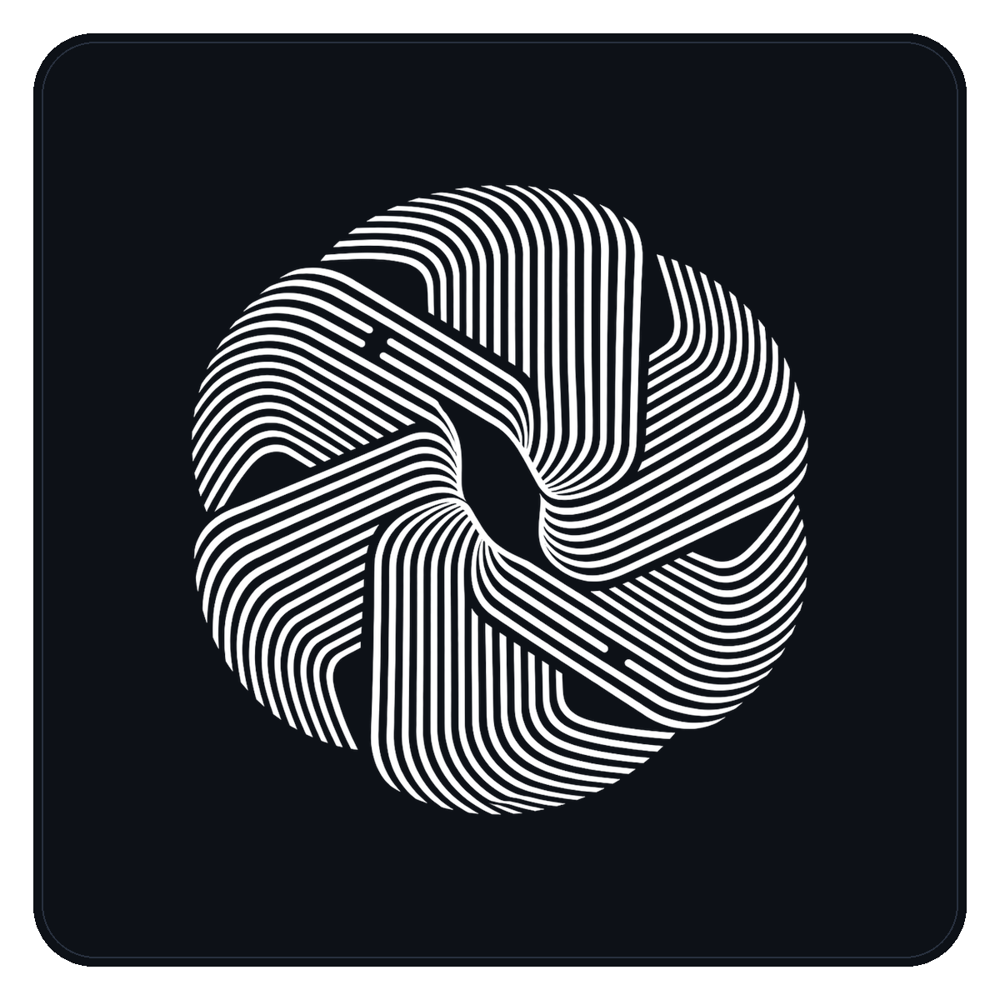

<div align="center">
  
</div>

<div align="center">
  <a href="https://www.ramioo.com">
    
  </a>
  <br/>
  <a href="https://www.ramioo.com">
    
  </a>
  <br/>
  <h1>
    <a href="https://www.ramioo.com">www.ramioo.com</a>
  </h1>
  <p>
    <b>زیرساخت شبکه · تجهیزات · سرور و رک · نرم‌افزار</b><br/>
    طراحی و اجرای دیتاسنتر، شبکه و سامانه‌ها
  </p>
  <p>
    <a href="https://www.ramioo.com"></a>
    <a href="https://www.ramioo.com/projects"></a>
    <a href="https://www.ramioo.com/contact"></a>
  </p>
</div>

<p align="center">
  
  
  
</p>

<div align="center">
  <a href="https://twitter.com/ramin_csy"></a>
  <a href="https://www.linkedin.com/in/raminzalizadeh"></a>
  <a href="https://medium.com/@ramincsy"></a>
  <a href="https://instagram.com/ramin_csy"></a>
  <a href="mailto:ramincsywork@gmail.com"></a>
</div>

---

### 👋 about me

**شبکه و دیتاسنتر + فول‌استک — سایت: [www.ramioo.com](https://www.ramioo.com)**

i'm **ramin** (`ramincsy`). I design and run **network infrastructure, racks, servers and switching**, and I also build software (**Sarafchi**, TRON / fintech). Brand **[ramioo](https://www.ramioo.com)** · **Tabriz**.

```typescript
const ramin = {
  github: "ramincsy",
  site: "https://www.ramioo.com",
  location: "Tabriz, Iran",
  roles: ["Network & Datacenter", "Full Stack Developer"],
  infra: ["racks", "servers", "switching", "firewall", "cabling"],
};
```

- 🖥️ **network & datacenter** — رک، سوئیچ، سرور، کابل‌کشی، فایروال، LAN/WAN
- 🔭 **Sarafchi** — trades, balances, rial / USDT, TRON deposits
- 🌱 public GitHub tools for **address formats** and **wallet balances**
- 📫 **[ramincsywork@gmail.com](mailto:ramincsywork@gmail.com)** · [ramincsy2@gmail.com](mailto:ramincsy2@gmail.com)

---

<div align="center">
  
</div>

<h2 align="center">زیرساخت شبکه · تجهیزات · سرور و رک</h2>

<p align="center">
  <b>طراحی، نصب و نگهداری اتاق سرور، رک، سوئیچ، فایروال و کابل‌کشی</b><br/>
  <a href="https://www.ramioo.com/services">خدمات شبکه و دیتاسنتر در ramioo.com</a>
</p>

<table>
  <tr>
    <td align="center" valign="top" width="50%">
      <a href="https://www.ramioo.com/projects/network-twin">
        
      </a>
      <br/>
      <h3><a href="https://www.ramioo.com/projects/network-twin">سرور و رک دیتاسنتر</a></h3>
      <b>Racks · Servers · Cabling · UPS / PDU</b>
    </td>
    <td align="center" valign="top" width="50%">
      <a href="https://www.ramioo.com/projects/network-twin">
        
      </a>
      <br/>
      <h3><a href="https://www.ramioo.com/projects/network-twin">تجهیزات شبکه</a></h3>
      <b>Switching · Routing · Firewall · VLAN / VPN</b>
    </td>
  </tr>
</table>

<p align="center">
  
  
  
  
  
  
  
  
  
</p>
<p align="center">
  
  
  
  
  
  
  
  
  
  
</p>

<p align="center">
  <a href="https://www.ramioo.com/projects/network-twin"></a>
  <a href="https://www.ramioo.com/services"></a>
</p>

---

### 🖼 selected work — click any photo → [ramioo.com](https://www.ramioo.com/projects)

<p align="center">
  <a href="https://www.ramioo.com/projects"></a>
</p>

<table>
  <tr>
    <td align="center" valign="top" width="50%">
      <a href="https://www.ramioo.com/projects/network-twin">
        
      </a>
      <br/>
      <h3><a href="https://www.ramioo.com/projects/network-twin">اطلس زیرساخت شبکه</a></h3>
      <b>Racks, topology, inventory</b>
      <br/>
      <a href="https://www.ramioo.com/projects/network-twin">مشاهده در سایت</a>
    </td>
    <td align="center" valign="top" width="50%">
      <a href="https://www.ramioo.com/projects/sarafchi">
        
      </a>
      <br/>
      <h3><a href="https://www.ramioo.com/projects/sarafchi">صرافچی — حسابداری ارزی</a></h3>
      Currency-exchange accounting
      <br/>
      <a href="https://github.com/ramincsy/Sarafchi">GitHub</a> · <a href="https://www.ramioo.com/projects/sarafchi">سایت</a>
    </td>
  </tr>
  <tr>
    <td align="center" valign="top" width="50%">
      <a href="https://www.ramioo.com/projects/digital-exchange">
        
      </a>
      <br/>
      <h3><a href="https://www.ramioo.com/projects/digital-exchange">هستهٔ صرافی دیجیتال</a></h3>
      Accounts, wallets, orders
      <br/>
      <a href="https://www.ramioo.com/projects/digital-exchange">مشاهده در سایت</a>
    </td>
    <td align="center" valign="top" width="50%">
      <a href="https://www.ramioo.com/projects/solar-intelligence">
        
      </a>
      <br/>
      <h3><a href="https://www.ramioo.com/projects/solar-intelligence">پایش نیروگاه خورشیدی</a></h3>
      Generation, health, alerts
      <br/>
      <a href="https://www.ramioo.com/projects/solar-intelligence">مشاهده در سایت</a>
    </td>
  </tr>
  <tr>
    <td align="center" valign="top" width="50%">
      <a href="https://www.ramioo.com/projects/vision-access">
        
      </a>
      <br/>
      <h3><a href="https://www.ramioo.com/projects/vision-access">کنترل تردد و پلاک‌خوان</a></h3>
      Cameras, AI, passage logs
      <br/>
      <a href="https://www.ramioo.com/projects/vision-access">مشاهده در سایت</a>
    </td>
    <td align="center" valign="top" width="50%">
      <a href="https://www.ramioo.com/projects/enterprise-directory">
        
      </a>
      <br/>
      <h3><a href="https://www.ramioo.com/projects/enterprise-directory">دفترچه تلفن سازمانی</a></h3>
      Contacts across large orgs
      <br/>
      <a href="https://www.ramioo.com/projects/enterprise-directory">مشاهده در سایت</a>
    </td>
  </tr>
</table>

<p align="center">
  <b>دمو و جزئیات کامل روی سایت است.</b><br/>
  <a href="https://www.ramioo.com">www.ramioo.com</a> ·
  <a href="https://www.ramioo.com/projects">پروژه‌ها</a> ·
  <a href="https://www.ramioo.com/services">خدمات</a> ·
  <a href="https://www.ramioo.com/contact">تماس</a>
</p>

---

### 📂 public GitHub repos

<p align="center">
  <a href="https://github.com/ramincsy/Sarafchi">
    
  </a>
  <a href="https://github.com/ramincsy/Best-Coin-Address-Validator-">
    
  </a>
</p>
<p align="center">
  <a href="https://github.com/ramincsy/Get-Balances">
    
  </a>
  <a href="https://github.com/ramincsy/Gthub-Achievements">
    
  </a>
</p>

- **[Sarafchi](https://github.com/ramincsy/Sarafchi)** — currency-exchange accounting (React + Flask + SQL Server, TronGrid USDT)
- **[Best-Coin-Address-Validator-](https://github.com/ramincsy/Best-Coin-Address-Validator-)** — C# address **format** checker (regex, not checksums)
- **[Get-Balances](https://github.com/ramincsy/Get-Balances)** — Python multi-network balance tracker, including TRX
- **[Gthub-Achievements](https://github.com/ramincsy/Gthub-Achievements)** — Persian GitHub collaboration playbook

---

<details open>
  <summary><h3>🛠️ languages & tools</h3></summary>

  <p align="center">
    
  </p>

  <h4>👨‍💻 programming</h4>
  <p>
    
    
    
    
    
    
    
    
    
    
    
  </p>

  <h4>🧰 frameworks & libraries</h4>
  <p>
    
    
    
    
    
    
    
    
  </p>

  <h4>⛓️ blockchain & web3</h4>
  <p>
    
    
    
    
    
    
    
    
  </p>

  <h4>🗄️ databases</h4>
  <p>
    
    
    
    
    
  </p>

  <h4>🌐 network infrastructure</h4>
  <p>
    
    
    
    
    
    
    
    
    
    
    
  </p>

  <h4>🏢 datacenter · racks · servers</h4>
  <p>
    
    
    
    
    
    
    
    
    
    
    
    
    
    
    
  </p>

  <h4>💻 daily tools</h4>
  <p>
    
    
    
    
  </p>

</details>

---

<details open>
  <summary><h3>📈 github stats</h3></summary>

  <p align="center">
    
  </p>

  <p align="center">
    
  </p>

  <p><b>note:</b> top languages is only a metric of the languages my public code consists of — not datacenter / network work.</p>

</details>

---

### 🎯 current focus

- **network & datacenter** — racks, switching, servers, cabling, stable LAN/WAN
- **[ramioo.com](https://www.ramioo.com)** — infrastructure and software from Tabriz
- **Sarafchi** — exchange back office (roles, trades, balances, TRON USDT)
- public **address** and **balance** tools that stay clear and useful

---

<div align="center">
  
</div>

<p align="center">
  made with 💙 by <a href="https://github.com/ramincsy">ramin</a>
  <br/>
  <sub>⭐ show some love by starring my repositories!</sub>
</p>
